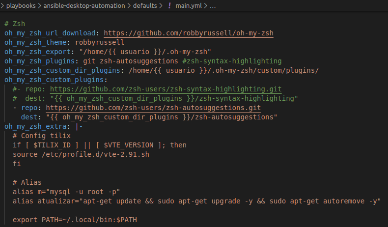

# ansible-desktop-automation

Sempre que preciso formatar meu notebook por alguma razão, sempre esqueço de instalar algumas ferramentas que utilizo no dia a dia, por isso resolvi automatizar esse processo criando a automação de desktop. Nesse projeto em ansible faço a instalação de alguns pacotes de uso geral pra quem trabalha com DevOps.

## Distribuições

Esse script em ansible foi testado nos SOs listados abaixo:

* Mint 19.3
* Ubuntu 18.04
* Ubuntu 20.04


## Lista de utilitários

Todos os utilitários listados abaixo serão instalados, esses utilitários estão no arquivo `tasks/appcommons.yml`. Caso não tenha interesse em instalar algum utilitário, basta comentar a linha. Caso tenha algum utilitário que é instalado usando o **apt-get**, basta incluir nesse arquivo.


## Lista de programas

Todos os programas listadas abaixo tambem podem ser ignoradas na instalação, para isso basta comentar a linha do arquivo `tasks/main.yml`.


## Preparando instalação

 - Configurações gerais

 A versão de instalação de todos os programas estão setados no arquivo `defaults/main.yml`, caso queira utilizar uma versão diferente basta alterar.

 - Configuração AWS cli

 É possível antes da instalação já informar as chaves de acesso a API AWS, para isso basta informar essas chaves no arquivo `defaults/main.yml`.


 - Configuração ZSH

 É possível adicionar novos plugins ao ZSH, novos temas e alias, para isso basta adicionar como mostrado abaixo no arquivo `defaults/main.yml`.



## Instalação

A instalação é feita apenas executando o comando abaixo:

**SHELL**
```bash
wget -qO- https://raw.githubusercontent.com/leandrolanza/ansible-desktop-automation/master/install.sh | bash -
```

